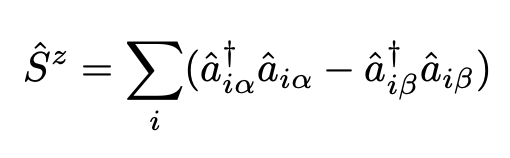
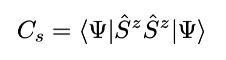
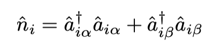
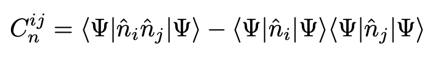
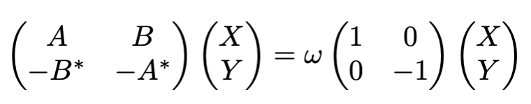
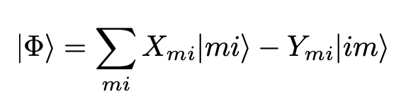

<!-- 
 -->
#### Current-current correlation function
- Assumptions
  - A transfer integral between m th atomic orbital(AO) and n th AO is denoted by $t_{mn}$
  - current operator $\hat{J}$: see below of Eq.3 of https://arxiv.org/abs/1807.01625
- current-current correlation function $C_{J}$ is defined as below
  - $C_{J} = \langle \Psi | \hat{J}\hat{J} | \Psi \rangle$ 
    - ($|\Psi\rangle$ is a wavefunction of system)
  - In this program, $C_{J}$ is limited to a case with same time and same position (i.e. $JJ$ has only two AO indices)

#### Spin-spin correlation function
The z component of the spin operator is given below, ignoring the constant multiple terms.
  
   
Spin-spin correlation function is given below:

#### Spin-spin correlation function
Occupation number operator at site $i$ is given below
  
   
Charge-charge correlation function is given below:

 
 #### Exciton correlation
 RPA方程式は
  
RPA波動関数は以下で表される。

- ただし、$m$は占有軌道のインデックス, $i$は仮想軌道のインデックス、
- $|mi\rangle$は$\hat{a}^{\dagger}_{i}\hat{a}_{m}|\mathrm{HF}\rangle$
- $X_{mi}$を分子軌道係数でAO基底に変換しexciton相関を得る。

 #### Green's function for a mean-field calculation
 - see Eq.7 of https://arxiv.org/abs/2002.05875
   - In this program, real space not reciprocal space is treated.
